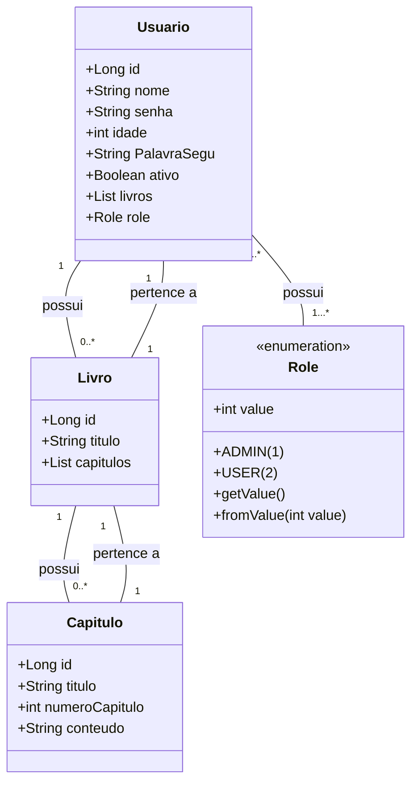

# DiarioDIgital

O projeto **DiárioDigital** surgiu como parte da disciplina de testes de software. O objetivo inicial da disciplina era apenas introduzir os alunos à prática de realizar testes em seu código. No entanto, com o decorrer da disciplina, o escopo do projeto se expandiu, passando de uma simples aplicação **Java** para uma plataforma completa. O **Back-End** foi desenvolvido em **Java**, utilizando o **framework Spring Boot**, enquanto o **Front-End** foi construído com **HTML**, **TypeScript** e **CSS**, contando com o apoio do **framework Angular**.

## Repositórios
- **DiarioDIgital** : [https://github.com/LucianoSegundo/DiarioDIgital](https://github.com/LucianoSegundo/DiarioDIgital)
- **DiarioDIgital** : [https://github.com/LucianoSegundo/DiarioDigital-Front-End](https://github.com/LucianoSegundo/DiarioDigital-Front-End)
- **Hospedado da Plataforma** : A plataforma pode ser testada [clicando aqui](https://diariodigital-front-end.onrender.com). A plataforma podera ser testada durante 30 dias, contanto apartir de **15/03/2025**, esse é o tempo de duração do banco de dados gratuito fornecido pela plataforma de hospedagem;
- **Hospegagem da API** : A documentação da API pode ser acessada [clicando aqui](lhttps://diariodigital-2.onrender.com/swagger-ui/index.html), assim comoa plataforma, só estará disponivel pelos proximos 30 dias, contando apartir do dia ***15/03/2025*.

## Diagrama de Classes
### Diagrama das Entidades do Sistema

texto comum
